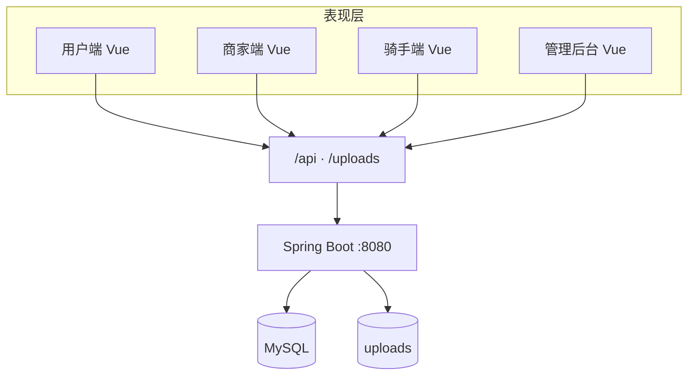
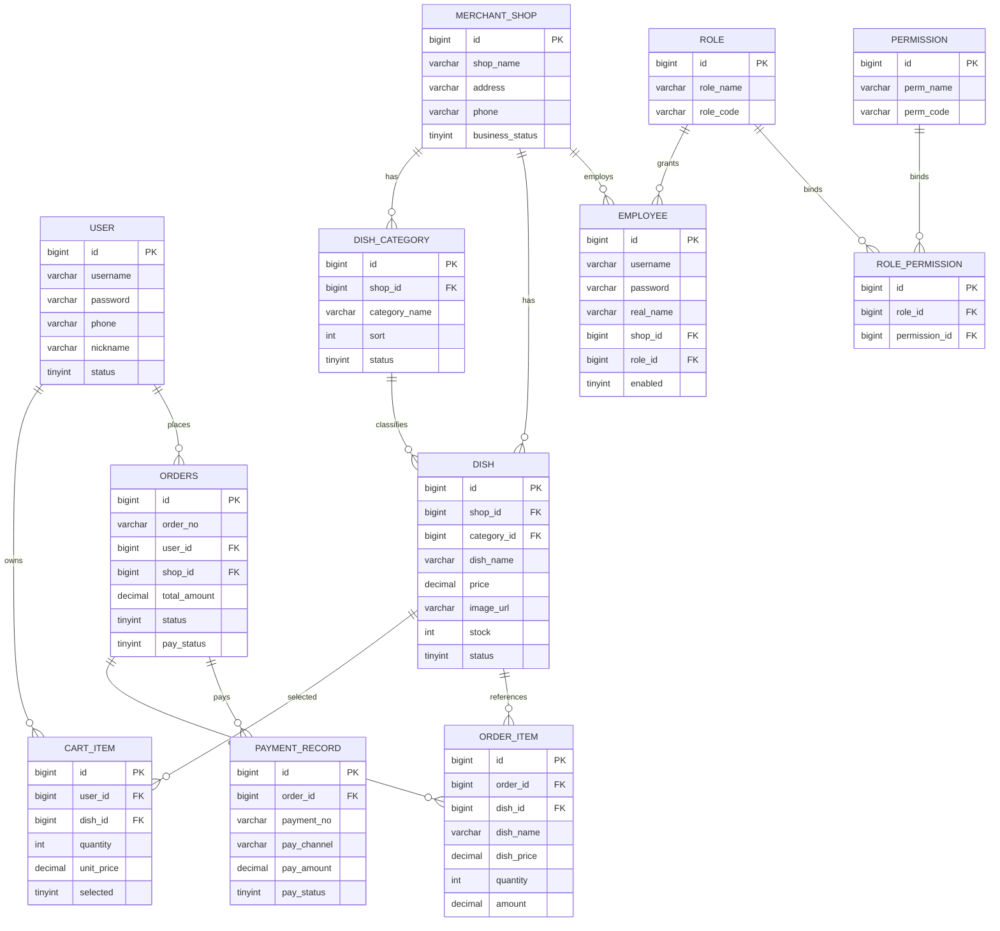

# 悦食汇（毕设）

## 项目要做什么

**悦食汇** 是一套面向校园或商圈场景的**外卖 / 订餐**类 Web 应用，毕设采用 **Vue（前端）+ Spring Boot（后端）** 实现。系统分为 **商家端** 与 **用户端** 两类角色：商家在后台维护店铺与经营数据，用户在 C 端浏览菜品、管理购物车、下单并完成支付与订单跟踪。

本仓库包含 **Spring Boot 后端**（根目录）与 **Vue 3 前端**（目录 `frontend/`），前端通过 REST 调用后端（接口约定见 `docs/后端接口文档.md`）。前端启动说明见 `frontend/前端说明.md`。

---

## 功能范围（与毕设目标对齐）

### 商家端

| 方向 | 说明 |
|------|------|
| 菜品信息 | 菜品的增删改查（含分类、上下架、价格与库存等，与店铺/分类关联） |
| 员工信息 | 员工的增删改查（账号、姓名、所属店铺、角色等） |
| 店铺状态 | 营业 / 打烊等开关，影响用户端是否可下单、是否展示可售菜品 |
| 权限与角色 | 员工与角色、权限的关联；通过角色与权限控制商家端操作范围（与员工启用/禁用配合） |

### 用户端

| 方向 | 说明 |
|------|------|
| 购物车 | 购物车商品的增删改查（数量、勾选等） |
| 下单 | 根据购物车生成订单，完成订单创建与金额计算 |
| 支付 | 订单支付流程（毕设可采用模拟支付，与真实支付渠道解耦） |
| 订单 | 订单状态查询、列表与详情；在规则允许下取消订单等 |

---

## 最终要实现的目标

1. **端到端可演示的毕设系统**：商家能完成店铺与菜品、员工、权限相关配置；用户能完成选品、下单、支付、查单等完整闭环。
2. **前后端分离、职责清晰**：后端提供稳定、可文档化的 API；前端 Vue 负责展示与交互，通过接口联调。
3. **数据与规则可落地**：核心业务（店铺营业状态、菜品上下架、库存、订单状态流转、支付结果与订单状态等）在后端校验并实现，避免仅靠前端“假数据”。
4. **可维护与可扩展**：模块划分清楚（认证、店铺、分类、菜品、员工、购物车、订单、支付等），便于答辩时说明架构与扩展点。

详细接口与字段约定见 `docs/后端接口文档.md`；数据库脚本见 `docs/init.sql`。

---

## 技术栈（后端本仓库）

- Java 17、Spring Boot（Web）
- 持久化与数据库：MySQL（表结构见 `docs/init.sql`），具体 ORM/访问方式在后续迭代中接入并实现
- 安全与鉴权：用户端 / 商家端登录、会话或 JWT 等（在实现阶段逐步落地）

---

## 建议的逐步实现顺序（开发路线）

以下为后端实现建议顺序，可与前端联调穿插进行：

1. **基础**：数据源、持久化访问、统一返回体与异常处理  
2. **认证**：用户注册/登录、员工登录、当前登录信息（JWT 或等价方案）  
3. **商家基础数据**：店铺信息、营业状态；菜品分类与菜品 CRUD  
4. **员工与角色**：员工 CRUD、启用/禁用、角色列表与权限模型  
5. **用户端商品**：按店铺/分类浏览上架菜品（受店铺营业状态约束）  
6. **购物车**：购物车项的增删改查与勾选  
7. **订单与支付**：下单、订单列表/详情、状态流转；模拟支付与状态查询  

每完成一块，即可与 Vue 端对接对应页面与流程，逐步达到毕设演示目标。

---

## 文档与目录提示

| 路径 | 说明 |
|------|------|
| `docs/后端接口文档.md` | 后端接口文档入口（路径、请求/响应示例） |
| `docs/init.sql` | 数据库初始化脚本（**全新建库**：含 `user` 收货字段） |
| `docs/patch-user-shipping.sql` | **存量数据库**补丁：为已有 `user` 表增加收货人、收货电话、地址、经纬度等字段（执行一次即可） |
| `src/main/java/...` | 业务代码（按模块划分） |

---

## 演示数据与登录交互（2026-05 快照）

- **多店演示菜**：`shop_id` 2（江南小厨）、3（韩味食堂）在最新 [`docs/init.sql`](docs/init.sql) 中各维护 **12** 道菜品（主食 / 小吃 / 饮品），定价分档；老库按需执行 [`docs/patch-expand-shop2-shop3-dishes.sql`](docs/patch-expand-shop2-shop3-dishes.sql)。
- **静态菜品图**：仓库内 [`frontend/public/dishes/`](frontend/public/dishes/) 提供配图；`init.sql` 中 `image_url` 多为 `/dishes/*.jpg`；HTTPS 外链改本地见 [`docs/patch-shop2-shop3-local-images.sql`](docs/patch-shop2-shop3-local-images.sql)。
- **登录错误与 401**：账号或密码错误时接口返回 **401**；[`frontend/src/api/request.js`](frontend/src/api/request.js) 对登录类路径豁免「清空 Token + 整页跳登录」，避免 Chrome 等浏览器看起来像整页刷新、看不到错误文案（约定见 [`docs/后端接口文档.md`](docs/后端接口文档.md) 接口约定 · 登录失败与 HTTP 401）。

---

## 近期开发记录（用户资料 · 鉴权体验 · 逆地理）

以下为同一阶段已落地内容，便于答辩说明「前后端如何协作、数据如何入库」。

### 数据库说明（重要）

- 头像、昵称、收货信息等均落在 **`user` 表**，**不另建新表**。
- **全新执行** `docs/init.sql` 建库：已包含收货相关列。
- **库已存在、且曾报 `Unknown column 'receiver_name'`**：在目标库执行一次 `docs/patch-user-shipping.sql` 后再启动后端。

### 后端

- **顾客资料**：`GET /api/user/profile`、`PUT /api/user/profile`（JWT 类型为 `USER`）。
- **头像上传**：`POST /api/user/upload/avatar`（`multipart/form-data`，字段 `file`），文件落在 `app.upload.dir`，通过 `/uploads/**` 对外访问。
- **逆地理编码**：`GET /api/user/geocode/reverse?latitude=&longitude=`；由 `GeocodeService` 使用 **Java HttpClient** 请求 **OpenStreetMap Nominatim** 公网接口，解析 JSON 中的 `display_name` 为可读地址；需合规 `User-Agent`，生产环境可替换为国内地图服务。
- **鉴权组件**：`UserAuthGuard` 校验顾客 Token；`/api/auth/me` 的 `AuthMeResponse` 增加 **`avatar`** 字段；`pom.xml` 显式依赖 **`jackson-databind`**，避免 IDE 无法解析 Jackson。

### 前端

- **路由守卫**：`frontend/src/router/guards.js` + 各路由 `meta`（`requiresUser` / `requiresMerchant` / `guestOnly`），未登录访问受保护页会跳转登录。
- **身份展示**：Pinia `stores/auth.js` 持久化顾客/商家展示信息；顾客顶栏可点头像区域进入资料页。
- **个人资料页**：路由 `/user/profile`（`UserProfileView.vue`），支持昵称、头像、收货信息；「根据当前位置填写地址」流程为：浏览器 `navigator.geolocation` 取经纬度 → 调用后端逆地理接口 → 回填表单 → 用户点击「保存」后 `PUT /user/profile` 写入数据库。
- **开发代理**：`vite.config.js` 已代理 `/api` 与 **`/uploads`**，本地可正常预览上传头像。

### 代码仓库

- 远程：`https://github.com/yuluo-eng/FoodieCloud.git`（推送前请确认本地已 `git remote add origin` 并完成首次 `push`）。

---

## 当前项目进展（2026-04）

> 以下为当前仓库已落地的功能快照，便于毕设阶段汇报与排期。

### 后端进展

- ✅ 认证：用户注册/登录、员工登录、`/api/auth/me`（顾客响应含 `avatar`）
- ✅ 顾客资料：`/api/user/profile`、头像上传 `/api/user/upload/avatar`、逆地理 `/api/user/geocode/reverse`
- ✅ 菜品：商家端 CRUD、上下架；用户端可售菜品查询
- ✅ 员工：列表、新增、修改、删除、启停、角色列表
- ✅ 购物车：列表、加入、改数量、删除、勾选、清空
- ✅ 订单：用户下单/列表/详情/取消；商家接单/配送/完成
- ✅ 支付（模拟）：创建支付单、模拟成功、查询支付状态
- ✅ 店铺：店铺信息查询/修改、营业状态切换
- ✅ 分类：分类列表/新增/修改/删除（含“有菜品禁止删除”）
- ✅ 图片上传：商家上传图片，URL 写入 `dish.image_url`，静态资源可访问
- ✅ 多店铺安全：商家端带 `shopId` 的读写按店铺隔离；`SUPER_ADMIN` 可跨店管理
- ✅ 管理端：平台代入驻（`POST /api/admin/shops`、`POST /api/admin/shops/{shopId}/employees/bootstrap`）、店铺列表与营业开关；详见 `docs/后端接口文档.md` §10

### 前端进展

- ✅ 首页与登录注册页已统一品牌视觉
- ✅ 用户端：菜品展示、购物车、下单、订单页、模拟支付按钮
- ✅ 商家端：员工管理、菜品管理、订单管理
- ✅ 菜品图片策略：优先 `image_url`，为空时关键词映射本地图
- ✅ 路由守卫（登录态与访客页）、顾客/商家身份展示（含头像与昵称类信息）
- ✅ 用户端个人资料页（头像、昵称、收货信息、定位辅助填地址）
- ✅ 管理后台商家页：新建店铺、创建店长账号（平台代入驻）

---

## 未完成工作清单（建议按答辩优先级推进）

### A. 前端界面待完善

1. **商家端店铺设置页**（店名/公告/营业状态）
2. **商家端分类管理页**（分类增删改查）
3. **菜品编辑弹窗**（当前主要是新增/上下架/删除）
4. **订单详情弹窗**（商家端查看 `order_item` 明细）
5. **统一状态提示**（替换 `alert`，改消息组件）
6. **异常页与空状态优化**（401/404/500）

### B. 后端接口待完善

1. **商家端权限细化**（在现有「按店铺隔离 + SUPER_ADMIN 跨店」基础上，可按角色细分写权限点）
2. **库存扣减与并发控制**（下单/支付成功后的库存一致性）
3. **订单状态事务化**（下单、支付回调、状态流转）
4. **上传模块增强**（大小限制、MIME 校验、旧图清理）
5. **操作日志 `operation_log` 真正落库**（关键操作审计）
6. **测试补齐**（Service 单测 + 关键接口集成测试）

### C. 前后端交互联调待完善

1. **统一错误码映射**（前端按 `code` 展示可读提示）
2. **401 自动跳转登录并清理 token**（用户端/商家端统一）
3. **字段约定统一**（分页结构、时间格式、金额格式）
4. **图片 URL 统一策略**（绝对 URL / 相对 URL 的约定）
5. **联调验收清单**（按用户故事逐条走通并截图留档）

---

## 项目上线流程（从本地到可访问）

### 1) 环境准备

- 服务器：Linux（2C4G 起步）或本机 **Docker Desktop**（见 `docs/Docker本地部署-Windows.md`）
- 依赖：JDK 17、MySQL 8；生产裸机可选 Nginx（仓库未提供宿主机配置文件）
- 域名与 HTTPS：生产环境可选用 Nginx + Let’s Encrypt（文档示例，非仓库必选项）

### 2) 数据库与后端部署

1. 创建数据库并执行 `docs/init.sql`
2. 配置 `application.properties`（生产库地址、账号密码、JWT secret）
3. 打包并启动：

```bash
./mvnw clean package -DskipTests
java -jar target/*.jar
```

4. 建议用 `systemd` 托管进程（开机自启、崩溃重启）

### 3) 前端部署

1. 在 `frontend/` 构建：

```bash
npm install
npm run build
```

2. 将 `frontend/dist` 部署到静态目录（或直接使用 `docker compose` 构建的 frontend 镜像，其内已含 Nginx 反代）
3. 若裸机部署：由 Nginx 反向代理 `/api` 到 Spring Boot（配置需自行编写，见 `deploy-guide.md` 注释示例）

### 4) 上传文件目录持久化

- `app.upload.dir` 配置到独立持久化路径（如 `/data/ysh/uploads`）
- 做目录权限与备份策略（避免重启丢图）

### 5) 上线验收

- 用户链路：登录 -> 浏览菜品 -> 加车 -> 下单 -> 支付 -> 查单
- 商家链路：登录 -> 菜品维护 -> 订单接单/配送/完成
- 异常链路：401、空数据、无权限、支付失败回滚

---

## 接下来可一起确认的细节（建议）

为了让 README 直接变成“答辩版项目文档”，你可以拍板这几项：

1. 是否将“未完成清单”拆成 **本周 / 下周 / 答辩前** 三段？
2. 是否补一张 **系统架构图 + 数据库 ER 图** 到 README？
3. 是否把“上线流程”细化为你当前机器可直接执行的脚本命令？

我可以在你确认后，继续把 README 升级成“可直接提交导师”的最终版本。

---

## 答辩版里程碑（建议排期）

### 本周（联调稳定阶段）

- 完成商家端图片上传与 `dish.image_url` 闭环验证
- 完成用户端下单 -> 支付 -> 商家履约全链路自测
- 统一前端错误提示（401、参数错误、网络异常）
- 产出接口联调记录（接口、入参、响应、截图）

### 下周（质量与展示阶段）

- 增加关键接口单元测试与集成测试
- 完成商家端店铺设置页、分类管理页
- 完成订单详情弹窗与状态筛选体验优化
- 输出《测试报告》（功能 + 异常 + 性能基础项）

### 答辩前（上线与材料阶段）

- 完成服务器部署演练（前后端 + 数据库 + Nginx）
- 完成 HTTPS 与上传目录持久化配置
- 完成演示账号、演示数据、演示脚本
- 完成论文/答辩 PPT 中“架构图 + ER 图 + 时序图”一致性校对

---

## 系统架构图（Mermaid）

> **部署说明（与仓库一致）**  
> - **开发联调**：Vite（5173）代理 `/api`、`/uploads` → Spring Boot（8080），宿主机不单独装 Nginx。  
> - **Docker**：`docker compose up` 三容器；反代由 **frontend 容器内** Nginx 完成（见 `frontend/nginx.conf`）。  
> - **裸机 Nginx**：`deploy-guide.md` 仅有示例注释，非毕设已验收路径。



---

## 数据库 ER 简图（Mermaid）



---

## 一键化上线脚本草案（可按你机器调整）

> 下面是可执行思路，建议后续拆成 `scripts/deploy.sh`。

```bash
# 1) 后端打包
./mvnw clean package -DskipTests

# 2) 启动后端（建议改为 systemd）
nohup java -jar target/*.jar > app.log 2>&1 &

# 3) 前端构建
cd frontend
npm ci
npm run build

# 4) 部署静态资源（示例）
# sudo rsync -avz dist/ /var/www/yueshihui/

# 5) Nginx reload
# sudo nginx -t && sudo systemctl reload nginx
```


