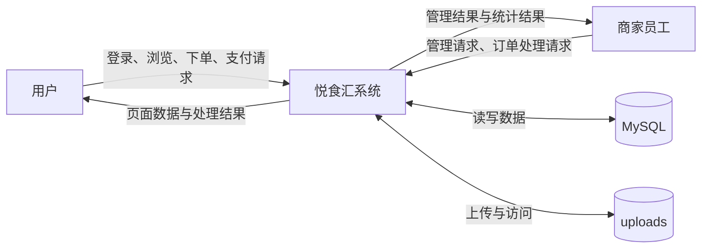
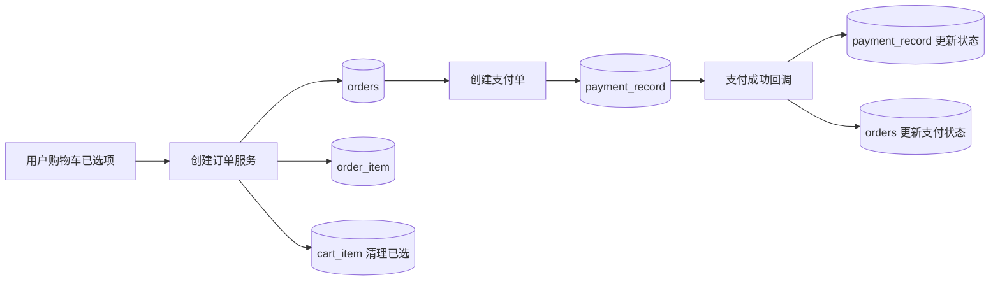
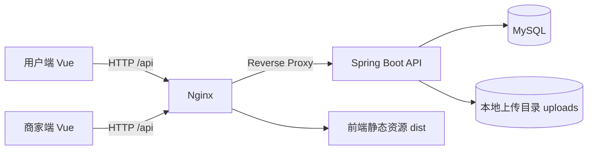
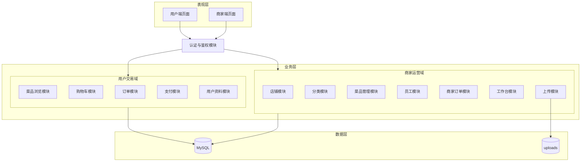
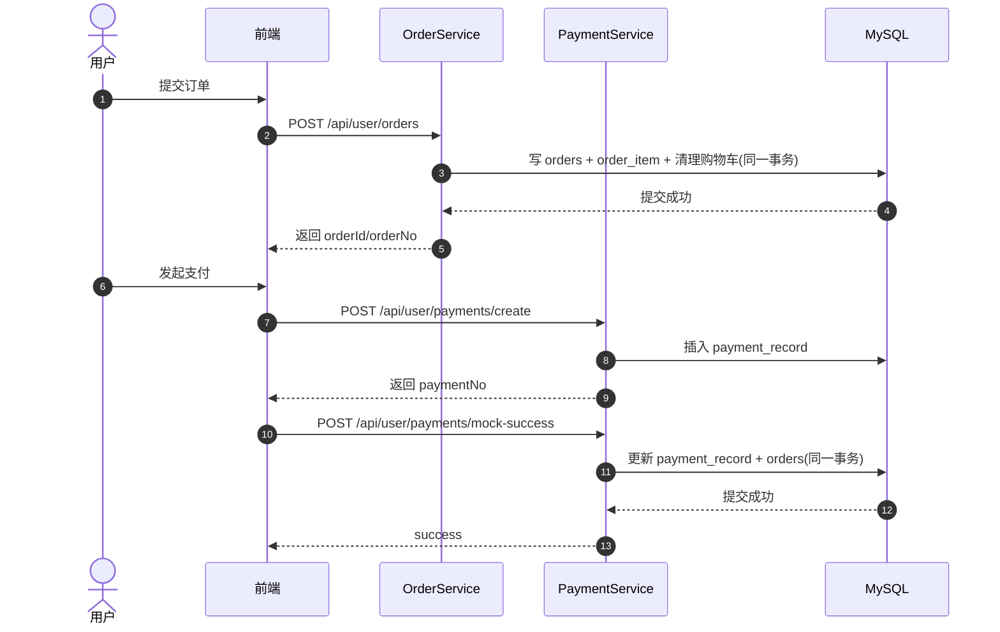
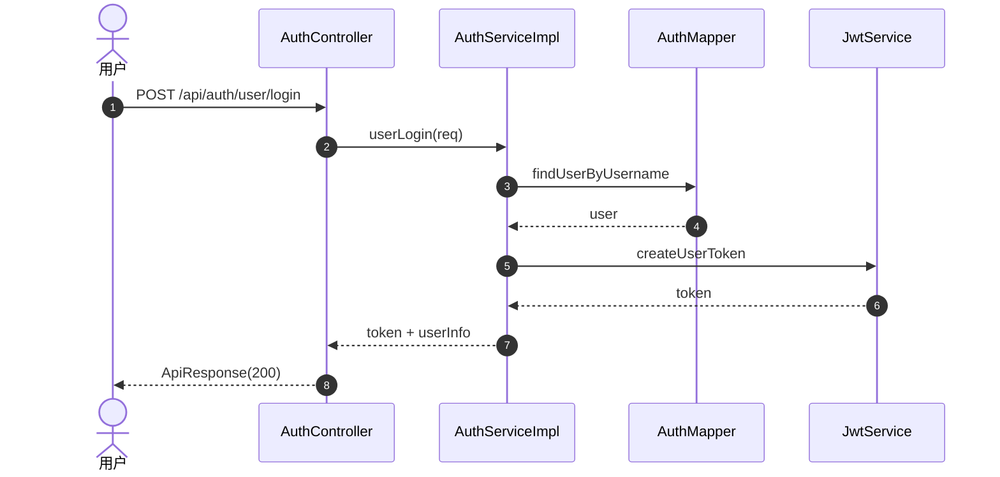
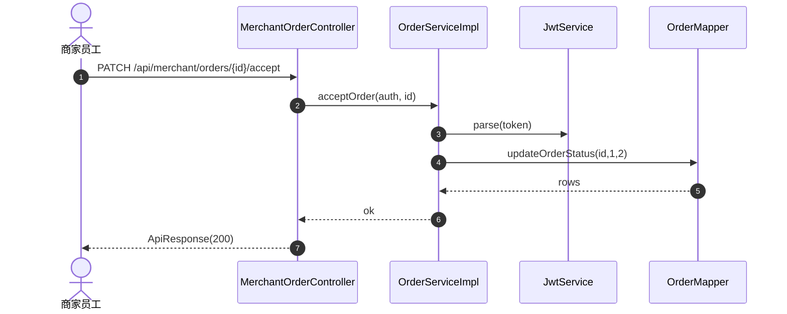
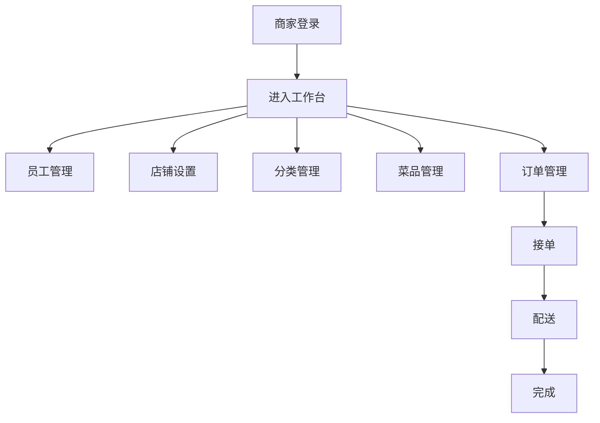
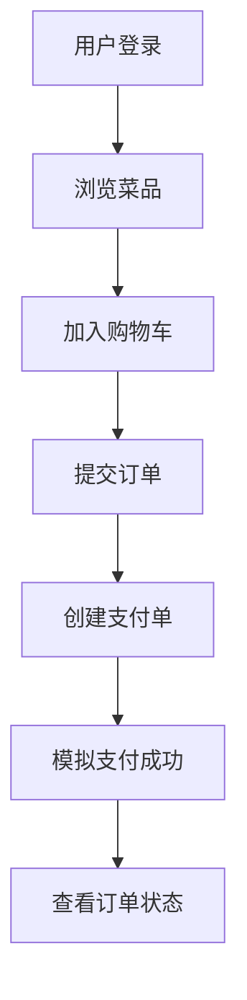

# 悦食汇点餐系统论文初稿（First Draft）

> 说明：本文档仅基于当前仓库已存在的实现与文档整理，不编造未实现功能。  
> 事实来源优先级：`src/main/java`、`src/main/resources/mapper`、`docs/init.sql`、`docs/后端接口文档.md`、`README.md`。

---

## 1 绪论

### 1.1 研究背景

随着校园和商圈内即时餐饮服务需求增加，点餐系统逐步从单体页面演进为前后端分离的业务系统。此类系统通常需要同时支持商家管理与用户下单两类场景，并在订单、支付、库存、权限等环节保证基本一致性与可维护性。

本项目“悦食汇”以毕设为背景，采用 Vue + Spring Boot + MyBatis + MySQL 的组合，构建一套可演示、可扩展的点餐系统原型。

### 1.2 研究意义

- 在工程实践层面，验证前后端分离架构在中小业务系统中的可落地性。
- 在业务实现层面，打通“浏览菜品 -> 购物车 -> 下单 -> 支付 -> 订单流转”的闭环。
- 在质量保障层面，针对核心链路引入事务化与基础测试，降低数据不一致风险。

### 1.3 国内外研究现状

国内外关于在线点餐与本地生活交易系统的研究，整体可归纳为三个层面：系统架构演进、交易一致性保障与权限安全模型。

第一，在系统架构层面，早期研究多聚焦于“Web 点餐系统功能实现”，核心目标是实现用户下单、后台管理与订单查询等基础流程。随着移动互联网与高并发场景发展，研究重点逐步转向可扩展性与高可用性，常见路径为“单体应用 -> 前后端分离 -> 微服务化”。国外与国内工程实践均表明，订单、支付、配送、用户与商家管理等能力需要解耦，以便实现独立扩容与故障隔离。对于毕设规模项目而言，直接采用复杂微服务体系并非唯一最优解，先在单体架构中落实分层设计、接口规范与关键链路一致性，仍然是可行且工程价值较高的方案。

第二，在交易一致性层面，学术界与工业界普遍认为“仅依赖单条 SQL 原子性不足以保障完整业务一致性”。经典工作 Sagas 提出将长事务拆分为一组可补偿的局部事务，以提升系统并发能力并降低锁持有时间。这一思想在现代分布式系统中被广泛借鉴，常与幂等、重试、状态机校验等机制配合使用。在订单系统场景中，支付回调重复通知、跨模块状态更新失败、并发写冲突是高频问题，因此研究与实践都强调“业务原子边界定义 + 幂等语义 + 异常回滚/补偿”三者结合。本项目当前已将“下单写订单+明细+清购物车”与“支付成功更新支付记录+订单状态”纳入事务边界，并在支付回调引入幂等分支，符合该研究方向在中小系统中的落地方式。

第三，在权限与安全层面，RBAC 模型已成为后台管理系统中最常见的授权思路。NIST 提出的 RBAC 标准化工作统一了角色、权限、会话与职责分离等核心概念，为工程实现提供了稳定语义。近年来研究也在 RBAC 基础上引入上下文约束与属性增强（如与 ABAC 融合），以适配动态授权场景。针对本项目，商家端已采用“员工身份 + 角色编码”的方式控制店铺、分类、菜品、员工等管理能力，能够覆盖当前业务规模；后续仍可按最小权限原则进一步细化订单处理权限与审计能力。

综合来看，国内外研究趋势可以概括为：架构上强调模块化与可扩展，交易上强调一致性与可恢复，安全上强调标准化权限模型。本项目的技术路线与该趋势一致，但在系统规模、复杂度与实现成本之间采取了“渐进式工程化”策略，即先保证核心链路正确与可测，再逐步引入并发控制、审计日志与更细粒度授权能力。

### 1.4 论文组织结构

- 第 1 章：绪论（背景、意义、现状与结构）。
- 第 2 章：开发工具和技术介绍（环境、工具、技术、方法）。
- 第 3 章：需求分析（功能、用例、可行性、性能）。
- 第 4 章：系统设计（架构、功能、详细设计、数据库）。
- 第 5 章：系统实现（商家端、用户端）。
- 第 6 章：系统测试（目的方法、项目、用例）。

---

## 2 开发工具和技术介绍

### 2.1 系统开发环境

#### 2.1.1 硬件环境

本项目开发与测试采用单机环境，硬件配置如下：

- CPU：Apple Silicon M3
- 内存：16 GB
- 操作系统：macOS 26

建议在论文终稿补充如下硬件参数，以满足毕业论文规范中的“实验环境可复现”要求：

- 处理器核心数
- 系统盘与数据盘容量
- 网络环境（本地开发/校园网/云服务器）

#### 2.1.2 软件环境

- JDK 17（`pom.xml` 中 `java.version=17`）。
- Spring Boot 4.0.5（`spring-boot-starter-parent`）。
- MyBatis Spring Boot Starter 3.0.4。
- MySQL 8.4.8（macOS arm64, Homebrew）。
- Maven Wrapper：3.9.14（`.mvn/wrapper/maven-wrapper.properties`）。
- 前端：Vue 3 + Vite（版本见 `frontend/package.json`）。
- Node.js 25.8.2，npm 11.11.1。

### 2.2 系统开发工具

- IntelliJ IDEA（后端开发）。
- Cursor/VSCode（代码与文档编辑）。
- Maven（后端构建）。
- npm + Vite（前端构建与调试）。
- Postman（接口调试与联调验证）。
- Git + GitHub（版本管理与 Issue 追踪）。

### 2.3 系统开发技术

- 后端：Spring Boot 提供 Web API，MyBatis XML 负责 SQL 映射。
- 鉴权：JWT（`JwtService` 生成与解析），用户端与商家端使用不同 `type`。
- 权限：商家端使用 `MerchantAuthGuard` 进行员工身份与角色校验。
- 前端：Vue Router + Pinia + axios，实现用户端与商家端页面与请求流程。
- 统一响应：`ApiResponse(code, msg, data)`。

#### 2.3.1 关键技术在项目中的应用对应

| 技术点 | 在本项目中的作用 | 代码/文档对应 |
|---|---|---|
| JWT | 登录态鉴权与身份识别 | `auth/security/JwtService.java` |
| MyBatis XML | SQL 与实体映射 | `src/main/resources/mapper/*.xml` |
| 事务注解 | 多步写库原子性保障 | `OrderServiceImpl#createOrder`、`PaymentServiceImpl#mockSuccess` |
| Vue Router 守卫 | 前端路由鉴权与跳转控制 | `frontend/src/router` |
| axios 拦截器 | 统一处理错误与 401 逻辑 | `frontend/src/api/request.js` |
| Postman | 接口联调与异常分支验证 | 测试流程记录 |

### 2.4 开发方法总结

本项目采用“增量实现 + 持续联调”的方式推进，先打通主链路，再补充管理能力与质量改进项。近期已落地的工程化改动包括：

- 用户下单流程事务化（`OrderServiceImpl.createOrder`）。
- 支付成功回调事务化与幂等保护（`PaymentServiceImpl.mockSuccess`）。
- 补充上述关键方法的单元测试用例。

### 2.5 本章小结

本章明确了项目的开发环境、工具与技术栈，为后续需求分析与系统设计提供实现基础。

---

## 3 需求分析

### 3.1 功能需求分析

基于当前实现，系统需求可归纳为两端能力：

- 用户端：注册登录、菜品浏览、购物车管理、下单、支付（模拟）、订单查询与取消。
- 商家端：员工登录、员工管理、店铺设置、分类管理、菜品管理、订单处理、工作台统计。

接口层面的已实现能力详见 `docs/后端接口文档.md`。

### 3.2 核心模块用例描述

#### 3.2.1 用户下单用例

- 参与者：用户。
- 前置条件：用户已登录，购物车存在选中项。
- 主流程：提交订单后，系统生成 `orders` 与 `order_item`，并清理已下单购物车项。
- 后置结果：返回 `orderId/orderNo/totalAmount/status`。

#### 3.2.2 支付成功回调用例（模拟）

- 参与者：用户/系统。
- 前置条件：支付单已创建。
- 主流程：调用支付成功接口，系统更新 `payment_record` 和对应订单支付状态。
- 约束：重复回调时按幂等处理。

#### 3.2.3 商家订单处理用例

- 参与者：商家员工。
- 主流程：已支付 -> 已接单 -> 配送中 -> 已完成。
- 约束：状态流转按顺序进行，不允许跳转。

### 3.3 整体系统用例图（按 UML 规范）

```mermaid
usecaseDiagram
  actor User as "用户"
  actor Staff as "商家员工"

  rectangle "悦食汇点餐系统" {
    (用户注册/登录) as UC1
    (浏览菜品与购物车) as UC2
    (提交订单) as UC3
    (创建支付单) as UC4
    (支付状态查询) as UC5
    (个人资料维护) as UC6

    (员工登录) as MC1
    (店铺设置) as MC2
    (分类与菜品管理) as MC3
    (订单接单与处理) as MC4
    (工作台数据统计) as MC5
    (员工管理) as MC6
  }

  User --> UC1
  User --> UC2
  User --> UC3
  User --> UC4
  User --> UC5
  User --> UC6

  Staff --> MC1
  Staff --> MC2
  Staff --> MC3
  Staff --> MC4
  Staff --> MC5
  Staff --> MC6

  UC3 ..> UC1 : <<include>>
  UC4 ..> UC1 : <<include>>
  MC2 ..> MC1 : <<include>>
  MC3 ..> MC1 : <<include>>
  MC4 ..> MC1 : <<include>>
```

### 3.4 主要用例描述表

| 用例编号 | 用例名称 | 参与者 | 前置条件 | 结果 |
|---|---|---|---|---|
| UC-01 | 用户登录 | 用户 | 账号存在且状态正常 | 返回用户 token 与基本信息 |
| UC-02 | 提交订单 | 用户 | 已登录，购物车有选中项 | 生成订单与订单明细，返回订单号 |
| UC-03 | 模拟支付成功 | 用户/系统 | 已创建支付单 | 更新支付状态与订单支付状态 |
| MC-01 | 菜品管理 | 商家员工 | 员工已登录且角色有权限 | 可新增/修改/上下架/删除菜品 |
| MC-02 | 商家订单处理 | 商家员工 | 存在已支付订单 | 按状态流转接单、配送、完成 |
| MC-03 | 店铺设置 | 商家员工 | 员工角色满足管理权限 | 修改店铺信息与营业状态 |
### 3.5 可行性分析

- 技术可行性：所用框架与组件成熟，且已完成核心链路实现。
- 经济可行性：本地开发环境可支撑毕设规模，不依赖高成本基础设施。
- 实施可行性：当前项目已具备前后端联调基础，后续主要为质量与体验增强。

### 3.6 性能需求分析

当前仓库尚未形成完整压测报告，现阶段性能需求以功能可用为主，后续建议补充：

- 接口响应时间统计（核心接口如登录、下单、支付）。
- 并发场景下库存与订单一致性验证（待后续库存模块落地）。
- 数据量增长下分页查询性能验证（订单、菜品、员工列表）。

### 3.7 数据流分析（DFD）

#### 3.7.1 系统上下文数据流图



#### 3.7.2 订单支付主流程数据流图



### 3.8 本章小结

本章明确了系统当前的业务需求边界，并识别了后续需补强的性能与质量验证项。

---

## 4 系统设计

### 4.1 系统架构设计

系统采用前后端分离架构：

- 前端（Vue）通过 HTTP 调用后端 `/api`。
- 后端（Spring Boot）承载业务逻辑。
- MyBatis XML 访问 MySQL 数据库。
- 上传资源通过 `uploads` 目录与静态资源映射对外提供。

#### 4.1.1 系统架构图



### 4.2 系统功能设计

按业务域划分为：认证、店铺、分类、菜品、员工、购物车、订单、支付、工作台统计等模块。  
模块职责和接口入口可在 `docs/后端接口文档.md` 与各 `*Controller` 中对应验证。

#### 4.2.1 系统功能模块图



### 4.3 系统详细设计

#### 4.3.1 分层设计

- Controller：参数接收与响应封装。
- Service：业务规则（鉴权、状态校验、事务边界等）。
- Mapper/XML：SQL 访问与数据映射。

#### 4.3.2 鉴权与权限设计

- 用户接口：通过 JWT 解析并校验 `type=USER`。
- 商家接口：通过 `MerchantAuthGuard` 进行员工身份及角色校验（部分订单接口目前仅校验员工身份）。

#### 4.3.3 订单与支付一致性设计（已落地）

- 下单流程：`orders + order_item + clearSelectedCart` 事务化。
- 支付回调：`markPaymentSuccess + updateOrderPaySuccess` 事务化，并加入幂等分支与行数校验。

#### 4.3.4 核心流程图（下单与支付）



#### 4.3.5 接口功能时序图（核心接口）

##### （1）用户登录与鉴权时序图



##### （2）商家订单处理时序图（接单/配送/完成）



### 4.4 数据库设计

数据库脚本见 `docs/init.sql`，核心表包括：

- 用户与权限：`user`、`employee`、`role`、`permission`、`role_permission`
- 店铺与菜品：`merchant_shop`、`dish_category`、`dish`
- 交易链路：`cart_item`、`orders`、`order_item`、`payment_record`
- 审计预留：`operation_log`（当前表已存在，业务落库待实现）

README 中已提供 ER 简图（Mermaid）。

#### 4.4.1 数据库 E-R 图（Chen 记法，13 实体）

说明：学校规范要求 Chen 记法（实体矩形、属性椭圆、联系菱形、基数标注）。  
Markdown/Mermaid 不适合严格表达 Chen 图形语义，因此本稿保留“关系事实清单 + 留白位”，终稿在 Word 中插入 draw.io/Visio 绘制的黑白 Chen 图。

（图 4-6 数据库 E-R 图（Chen）留白位）

> 【留白】此处插入 Chen 记法 E-R 图（依据 `docs/init.sql`，共 13 实体）。

关系事实（用于绘图标注基数）：
- merchant_shop 与 employee：1:N
- role 与 employee：1:N
- role 与 permission：M:N（通过 role_permission 实现）
- merchant_shop 与 dish_category：1:N
- merchant_shop 与 dish：1:N
- dish_category 与 dish：1:N
- user 与 cart_item：1:N
- dish 与 cart_item：1:N
- user 与 orders：1:N
- merchant_shop 与 orders：1:N
- orders 与 order_item：1:N
- dish 与 order_item：1:N
- orders 与 payment_record：1:N（当前业务通常按 1:1 使用）
- operation_log 与 user/employee：逻辑关联（无外键）

#### 4.4.2 数据表清单（全表）

| 序号 | 表名 | 作用 |
|---|---|---|
| 1 | `user` | 用户账户与收货信息 |
| 2 | `merchant_shop` | 店铺基础信息 |
| 3 | `role` | 角色定义 |
| 4 | `permission` | 权限定义 |
| 5 | `role_permission` | 角色权限关联 |
| 6 | `employee` | 商家员工账户 |
| 7 | `dish_category` | 菜品分类 |
| 8 | `dish` | 菜品主数据 |
| 9 | `cart_item` | 用户购物车项 |
| 10 | `orders` | 订单主表 |
| 11 | `order_item` | 订单明细表 |
| 12 | `payment_record` | 支付记录表 |
| 13 | `operation_log` | 操作审计日志表（预留） |

### 4.5 本章小结

本章完成了系统从架构到模块再到关键一致性设计的说明，并与当前代码实现保持一致。

---

## 5 系统实现

### 5.1 商家端实现

当前已实现能力（以现有页面与接口为准）：

- 员工登录与身份展示。
- 员工管理（增删改查、启停）。
- 店铺设置（店名、公告、营业状态）。
- 分类管理（增删改查）。
- 菜品管理（增删改查、上下架、图片上传）。
- 订单管理（列表、详情、接单、配送、完成）。
- 工作台统计（今日订单、营收、员工数、菜品数）。

#### 5.1.1 商家端功能流程图（示意）



### 5.2 用户端实现

当前已实现能力：

- 用户注册登录、获取当前登录信息。
- 菜品浏览（按店铺/分类）。
- 购物车管理（增删改、勾选、清空）。
- 下单、订单列表与详情、未支付取消。
- 支付创建、模拟成功、支付状态查询。
- 用户资料与头像上传（含逆地理辅助填地址）。

#### 5.2.1 用户端功能流程图（示意）



### 5.3 核心功能流程图（端到端）


### 5.4 本章小结

系统已实现双端核心业务闭环，具备演示与后续优化基础。未实现部分（如库存扣减、操作日志落库）在后续计划中推进。

---

## 6 系统测试

### 6.1 测试目的与方法

测试目标：

- 验证核心业务流程可用性。
- 验证关键一致性逻辑在异常分支下的行为。

测试方法：

- 单元测试：覆盖 Service 关键方法分支。
- 接口联调测试：通过 Postman 验证端到端流程。
- 手工功能测试：通过前端页面验证用户与商家操作链路。

测试部署形态与端口配置：

- 部署方式：单机部署
- 前端端口：5173（Vite dev server，已在本地启动验证）
- 后端端口：8080（Tomcat 监听端口，已在本地启动验证）

### 6.2 测试项目

已具备的测试与验证项：

- JWT 与商家鉴权相关测试（仓库已有）。
- 新增下单与支付关键方法测试：
  - `OrderServiceImplTest`
  - `PaymentServiceImplTest`

  建议继续补充（待补充）：

- 订单/支付关键接口集成测试。
- 并发场景测试（库存与状态冲突）。

### 6.3 测试用例

已覆盖用例（单测）示例：

- 下单成功路径。
- 购物车为空下单失败。
- 清空已选购物车行数异常触发业务冲突。
- 支付回调幂等（重复回调）。
- 支付单不存在。
- 支付状态/订单状态冲突分支。

#### 6.3.1 关键测试用例表

| 编号 | 测试对象 | 输入/场景 | 预期结果 |
|---|---|---|---|
| TC-01 | `createOrder` | 购物车有选中项 | 创建订单成功并清理已选购物车 |
| TC-02 | `createOrder` | 购物车为空 | 抛业务异常（400） |
| TC-03 | `createOrder` | 清理已选购物车行数为 0 | 抛业务异常（409） |
| TC-04 | `mockSuccess` | 支付单不存在 | 抛业务异常（404） |
| TC-05 | `mockSuccess` | 支付单已成功 | 幂等返回，不重复更新 |
| TC-06 | `mockSuccess` | 支付更新行数为 0 | 抛业务异常（409） |
| TC-07 | `mockSuccess` | 订单更新行数为 0 | 抛业务异常（409） |

#### 6.3.2 手工测试记录建议模板

| 用例 | 请求接口 | 入参 | 实际响应 | 是否通过 | 备注 |
|---|---|---|---|---|---|
| 下单成功 | `/api/user/orders` | `shopId/remark` | `code=200` | 是/否 |  |
| 重复支付回调 | `/api/user/payments/mock-success` | `paymentNo` | 幂等成功 | 是/否 |  |
| 异常支付号 | `/api/user/payments/mock-success` | 不存在流水号 | `code=404` | 是/否 |  |

手工联调用例（Postman）：

- 登录 -> 加购物车 -> 下单 -> 创建支付 -> 模拟支付成功。
- 重复回调验证幂等。
- 构造异常数据验证 404/409 业务码分支。

### 6.4 本章小结

当前测试已覆盖近期事务化改动的核心风险点，但距离完整测试体系仍有差距，后续需继续补齐集成测试与性能测试。

---

## 附：待补充项清单（不编造）

- 国内外研究现状的文献综述与引用。
- 测试数据库数据规模（用户/菜品/订单等大致条数）。
- 性能测试与压力测试数据报告（当前未开展压测）。
- 库存扣减与并发控制实现后的专项验证。
- `operation_log` 业务落库后的审计测试结果。

---

## 附录 A 图表目录（当前稿）

- 图 4-1 系统架构图
- 图 3-1 整体系统用例图
- 图 3-2 系统上下文数据流图
- 图 3-3 订单支付主流程数据流图
- 图 4-2 系统功能模块图
- 图 4-3 下单与支付时序图
- 图 4-4 用户登录与鉴权时序图
- 图 4-5 商家订单处理时序图
- 图 4-6 数据库 E-R 图（Chen，13 实体）
- 图 5-1 商家端功能流程图
- 图 5-2 用户端功能流程图
- 图 5-3 核心功能端到端流程图
- 表 2-1 关键技术应用对应表
- 表 3-1 主要用例描述表
- 表 4-1 数据表清单（全表）
- 表 6-1 关键测试用例表
- 表 6-2 手工测试记录模板

---

## 附录 B 图文引用模板（可直接用于正文）

### B.1 需求分析章节图文模板

- 图 3-1（整体系统用例图）引用模板：  
  “如图 3-1 所示，系统包含用户与商家员工两类核心参与者。用户侧关注点在于点餐交易闭环，商家侧关注点在于运营管理与履约处理，两类用例共同构成系统的功能边界。”

- 图 3-2（系统上下文数据流图）引用模板：  
  “如图 3-2 所示，系统处于用户、商家员工与数据存储之间的中枢位置，前后端交互请求最终沉淀到数据库与文件存储，体现了本系统的数据流向与外部交互关系。”

- 图 3-3（订单支付主流程数据流图）引用模板：  
  “如图 3-3 所示，订单与支付数据流遵循‘购物车选中项 -> 订单生成 -> 支付记录 -> 支付状态回写订单’路径，是系统一致性控制的核心链路。”

### B.2 系统设计章节图文模板

- 图 4-1（系统架构图）引用模板：  
  “如图 4-1 所示，系统采用前后端分离架构，Nginx 作为入口进行反向代理，后端统一处理业务逻辑并访问 MySQL 与上传目录，具备较好的模块解耦性。”

- 图 4-2（系统功能模块图）引用模板：  
  “如图 4-2 所示，系统按业务能力划分为认证、店铺、菜品、购物车、订单、支付等模块，模块之间通过统一 API 协作，降低了后续功能扩展的耦合成本。”

- 图 4-3（下单与支付时序图）引用模板：  
  “如图 4-3 所示，下单与支付两阶段分别定义清晰的写库边界，并在关键步骤设置事务控制，确保核心交易数据的一致性。”

- 图 4-4（用户登录与鉴权时序图）引用模板：  
  “如图 4-4 所示，用户登录后由认证服务签发 JWT，后续请求通过携带 Token 完成身份识别，实现了无状态鉴权机制。”

- 图 4-5（商家订单处理时序图）引用模板：  
  “如图 4-5 所示，商家订单处理流程在进入业务方法前完成员工身份校验，并通过状态条件更新限制非法流转，保证订单状态机的正确性。”

- 图 4-6（数据库 E-R 图）引用模板：  
  “如图 4-6 所示，系统数据库以 Chen 记法表达了用户交易链路与商家管理链路的主要实体关系，并通过基数标注体现了各实体间的 1:1、1:N、M:N 约束特征。”

### B.3 系统实现章节图文模板

- 图 5-1（商家端功能流程图）引用模板：  
  “如图 5-1 所示，商家端以工作台为入口，向店铺、员工、菜品和订单管理分流，体现了后台运营场景的功能组织方式。”

- 图 5-2（用户端功能流程图）引用模板：  
  “如图 5-2 所示，用户端流程围绕‘选品 -> 购物车 -> 下单 -> 支付 -> 查单’展开，符合典型在线点餐业务路径。”

- 图 5-3（核心功能端到端流程图）引用模板：  
  “如图 5-3 所示，系统从用户支付完成延伸到商家接单配送，完整覆盖交易与履约阶段，验证了系统端到端业务闭环能力。”

### B.4 图表写作注意事项

- 首次引用图表时使用“如图 X-X 所示/由表 X-X 可知”句式。
- 每张图后建议补 2-4 句分析，不仅描述“画了什么”，还要说明“支持了什么结论”。
- 图表编号在 Word 中建议用“章节号-序号”统一管理，避免后期增删导致错位。

---

## 附录 C 制图规范落地说明

### C.1 全局规范

- 全文图表采用黑白灰风格，不使用彩色与 Emoji。
- 图内文字统一字体（中文宋体、英文与数字 Times New Roman），字号统一小于正文一号。
- 连线尽量横平竖直，图形节点按行列对齐。
- 图题置于图下方，表题置于表上方（在 Word 排版阶段统一处理）。

### C.2 UML 与流程图规范

- 用例图：参与者在系统边界外，用例在系统边界内；`<<include>>` 使用虚线箭头。
- 时序图：保持“请求实线、返回虚线”的表达习惯，参与者与生命线完整。
- 流程图：开始/结束、处理、判断节点语义明确，判断分支标注“是/否”。

### C.3 E-R 图规范

- 终稿使用 Chen 记法：实体（矩形）、属性（椭圆）、联系（菱形）、基数（1:1/1:N/M:N）。
- 本 Markdown 稿中提供的是“事实关系清单 + 留白位”，用于确保内容不失真。
- 最终插图必须严格依据 `docs/init.sql`，不得新增代码中不存在的实体与关系。

---

## 参考文献（草稿）

[1] Garcia-Molina H, Salem K. Sagas[C]//Proceedings of the 1987 ACM SIGMOD International Conference on Management of Data. New York: ACM, 1987: 249-259. DOI:10.1145/38714.38742.

[2] Ferraiolo D F, Sandhu R, Gavrila S, et al. Proposed NIST Standard for Role-Based Access Control[J]. ACM Transactions on Information and System Security, 2001, 4(3): 224-274.

[3] Sandhu R S, Coyne E J, Feinstein H L, et al. Role-Based Access Control Models[J]. IEEE Computer, 1996, 29(2): 38-47.

[4] Yu Y. Design and Implementation of Online Food Ordering System Based on Springcloud[J]. Information Systems and Economics, 2022, 3: 66-71.

[5] Suryotrisongko H, Jayanto D P, Tjahyanto A. Design and development of backend application for public complaint systems using microservice spring boot[J]. Procedia Computer Science, 2017, 124: 736-743.

[6] Menezes G, Cafeo B, Hora A. How are framework code samples maintained and used by developers? The case of Android and Spring Boot[J]. Journal of Systems and Software, 2022, 185: 111146.

[7] 美团技术团队. 美团外卖订单中心的演进[EB/OL]. (2016-10-19)[引用日期待补充]. 可从公开技术转载站点获取原文。

[8] 赵某某, 崔某某, 袁某某. 基于微服务架构的信息系统设计与实现[C]//相关国际会议论文集, 2022.

> 注：第 [7]、[8] 条建议在终稿阶段替换为可稳定访问、可核验的正式来源（含作者、发布时间、链接和访问日期）。

