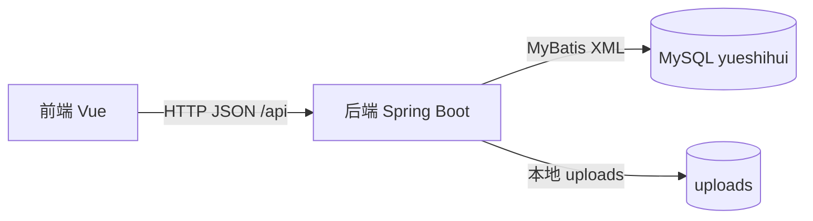
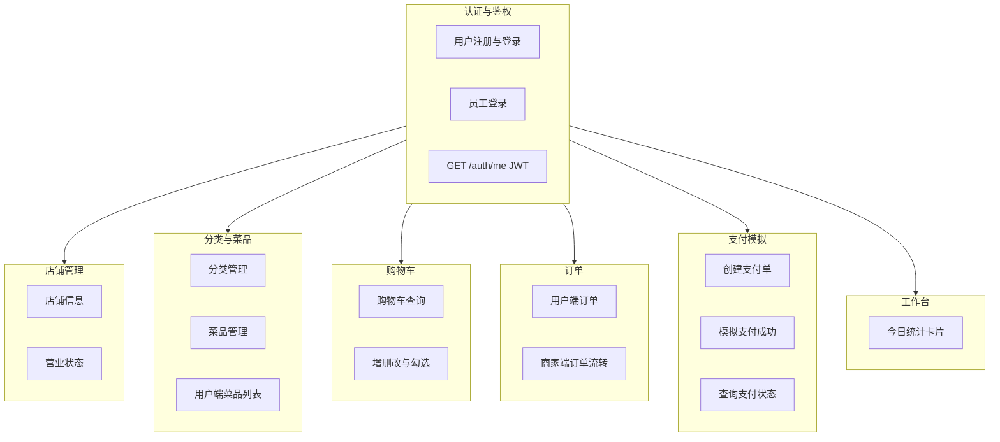
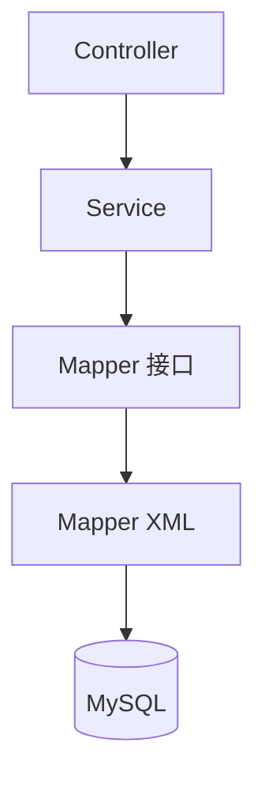
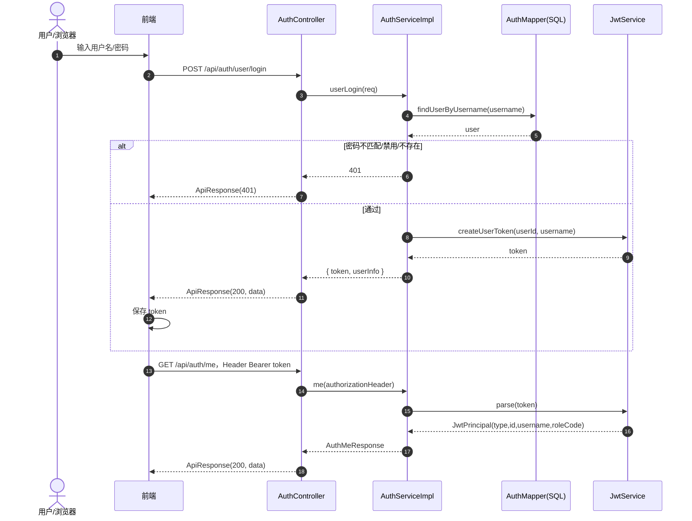
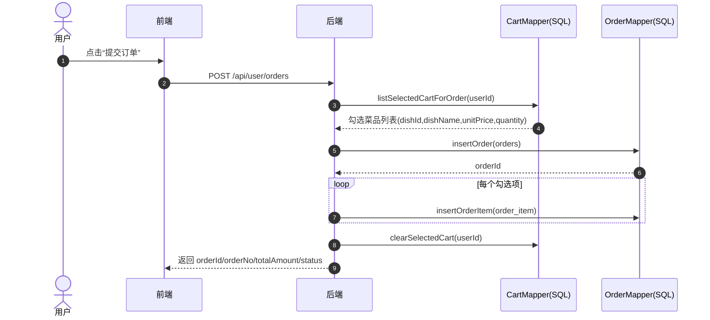
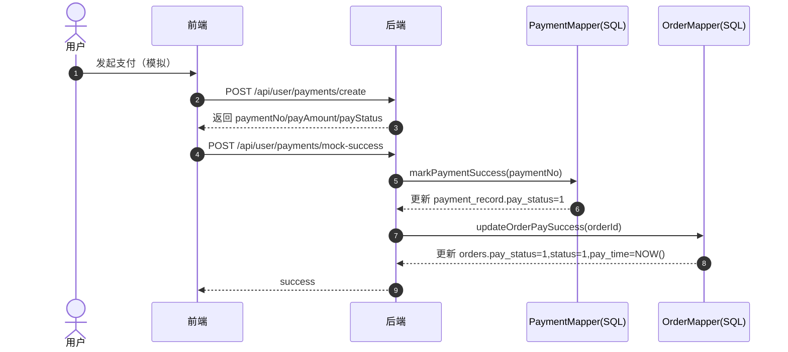
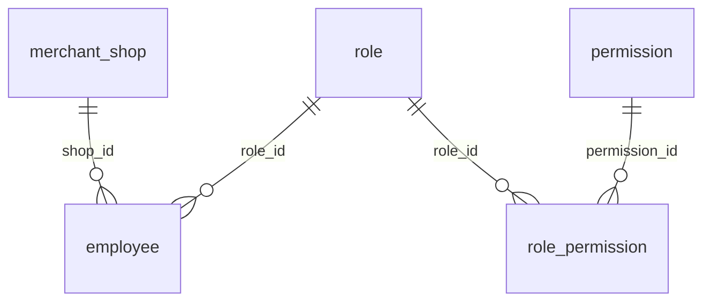
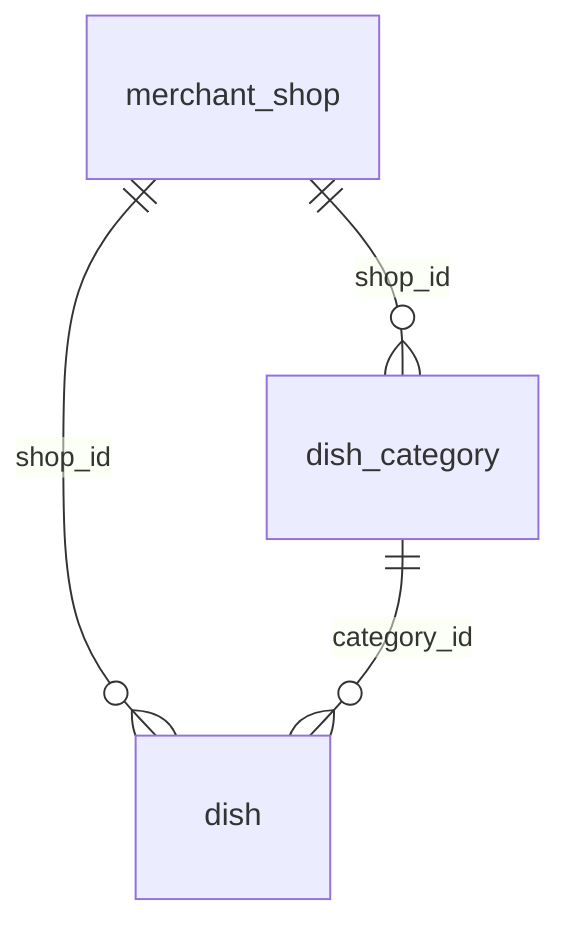
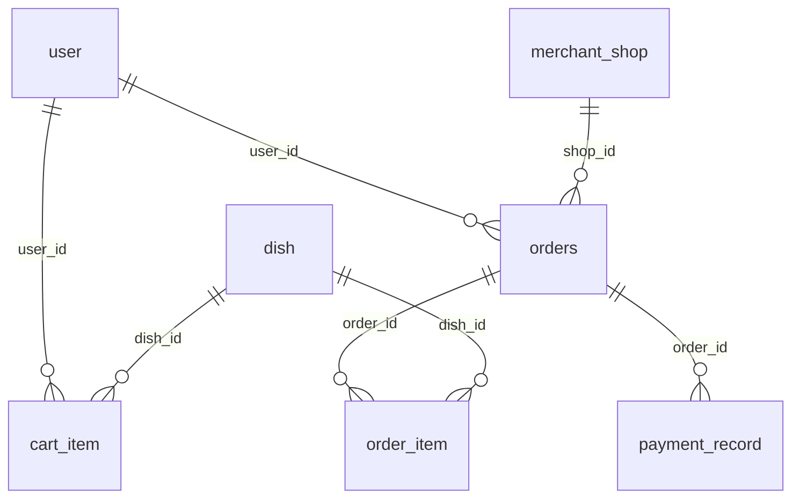

# for monday check  

> - 数据库：`docs/init.sql`（字段名、类型、约束以此为准）  
> - 接口约定：`docs/backend-api.md`  
> - SQL 映射：`src/main/resources/mapper/*.xml`  
> - 认证实现：`src/main/java/com/example/springbootblank/auth/security/JwtService.java`、`AuthServiceImpl.java`、`AuthController.java`  
> 
>若某信息在上述来源中未出现，本文档会标记为 **待确认**，不进行推测。

---

## 一、系统设计（概要设计）

### 1.1 系统目标与范围

系统名称：**悦食汇点餐系统**（前后端分离）。  
主要用户角色：
- **C 端用户（USER）**：浏览菜品、购物车、下单、支付（模拟）、查看订单。
- **商家端员工（EMPLOYEE）**：员工/店铺/分类/菜品/订单管理、工作台统计。

鉴权方式：HTTP Header `Authorization: Bearer <token>`（JWT）。

---

### 1.2 总体架构与技术栈（逻辑视图）

- **前端**：`frontend/`（Vite + Vue）。  
- **后端**：Spring Boot + MyBatis（XML Mapper）。  
- **数据库**：MySQL（见 `docs/init.sql`）。

#### 1.2.1 主要技术选型（以仓库 `pom.xml` / `frontend/package.json` 为准）

| 层级 | 技术 | 版本/说明（来源） |
|---|---|---|
| 后端框架 | Spring Boot | `spring-boot-starter-parent` **4.0.5**（`pom.xml`） |
| 运行环境 | JDK | **17**（`pom.xml` → `java.version`） |
| Web | spring-boot-starter-web | 随父 POM 管理版本 |
| 校验 | spring-boot-starter-validation | 随父 POM |
| 持久层 | MyBatis Spring Boot Starter | **3.0.4**（`pom.xml`） |
| 数据库驱动 | mysql-connector-j | runtime（`pom.xml`） |
| 密码散列 | spring-security-crypto（BCrypt） | 依赖存在（`pom.xml`） |
| JWT | jjwt-api / jjwt-impl / jjwt-jackson | **0.12.6**（`pom.xml`） |
| 前端构建 | Vite | **6.0.7**（`frontend/package.json`） |
| 前端框架 | Vue | **3.5.13** |
| 路由/状态 | vue-router / pinia | **4.5.0 / 2.3.0** |
| HTTP 客户端 | axios | **1.7.9** |

---

### 1.3 功能模块划分（模块视图）

按接口文档与后端包结构（`com.example.springbootblank.*`）划分：

#### 1.3.1 后端分层结构（概要）

本仓库后端采用典型的 **Controller → Service → Mapper(XML) → MySQL** 分层：

- **Controller**：暴露 REST 接口（路径前缀多为 `/api/**`），负责参数接收与统一响应封装（`ApiResponse`）。
- **Service**：承载业务规则（例如登录校验、购物车校验、订单金额汇总、商家权限校验入口等）。
- **Mapper + XML**：承载 SQL 与结果映射；下划线字段通过 `map-underscore-to-camel-case=true` 映射到 Java 驼峰属性（`application.properties`）。

---

### 1.4 关键业务流程（时序图）

#### 1.4.1 登录获取 Token + 后续携带 Token

（严格对应：`AuthController` → `AuthServiceImpl` → `JwtService` → `AuthMapper.xml`）

#### 1.4.2 用户下单（从购物车生成 orders + order_item）

（严格对应：`CartMapper.xml#listSelectedCartForOrder`、`OrderMapper.xml#insertOrder/insertOrderItem`，以及接口文档第 7 章描述）

#### 1.4.3 模拟支付成功（payment_record + 更新订单支付状态）

（严格对应：`PaymentMapper.xml#markPaymentSuccess`、`OrderMapper.xml#updateOrderPaySuccess`，以及接口文档第 8 章描述）

---

### 1.5 通信与接口约定（概要）

以下内容以 `docs/backend-api.md` 为准（与实现一致）：

- **Base URL**：`/api`
- **鉴权**：`Authorization: Bearer <token>`
- **请求体**：`application/json`
- **统一响应体**：`{ "code": 200, "msg": "success", "data": ... }`（实现类为 `ApiResponse`）

---

### 1.6 安全设计概要（JWT + 商家端角色）

- **用户端（USER）**：登录成功后签发 JWT；用户端业务接口在 Service 内解析 token，并要求 `JwtPrincipal.type == USER`（见 `OrderServiceImpl.resolveUserId` 逻辑）。
- **商家端（EMPLOYEE）**：登录成功后签发 JWT，并在 payload 中携带 `role`（员工 `role_code`）；部分管理能力通过 `MerchantAuthGuard.requireEmployeeRole` 限制允许的角色编码。
- **测试兜底**：`MerchantAuthGuard` 中对用户名为 `admin` 的员工在角色校验时直接放行（代码注释写明“便于联调”）。

---

## 二、系统设计（详细设计）

### 2.1 数据库设计

#### 2.1.1 ER 图（基于 `docs/init.sql` 外键约束）

**（1）组织与权限**

**（2）店铺与菜品**

**（3）购物车与订单支付**

---

#### 2.1.2 数据字典（严格按 `docs/init.sql`）

> 字段类型、是否可空、默认值、约束以 `init.sql` 为准。下表仅摘录关键字段；若需要可扩展为全字段版。

##### （1）`user` 用户表

| 字段 | 类型 | 约束/默认 | 说明 |
|---|---|---|---|
| id | BIGINT | PK, AUTO_INCREMENT | 用户ID |
| username | VARCHAR(50) | NOT NULL, UNIQUE | 用户名 |
| password | VARCHAR(100) | NOT NULL | 密码（加密后） |
| phone | VARCHAR(20) | UNIQUE, NULL | 手机号 |
| nickname | VARCHAR(50) | NULL | 昵称 |
| avatar | VARCHAR(255) | NULL | 头像URL |
| status | TINYINT | NOT NULL, DEFAULT 1 | 1正常 0禁用 |
| create_time | DATETIME | NOT NULL, DEFAULT CURRENT_TIMESTAMP | 创建时间 |
| update_time | DATETIME | NOT NULL, DEFAULT CURRENT_TIMESTAMP ON UPDATE | 更新时间 |

##### （2）`merchant_shop` 店铺表

| 字段 | 类型 | 约束/默认 | 说明 |
|---|---|---|---|
| id | BIGINT | PK, AUTO_INCREMENT | 店铺ID |
| shop_name | VARCHAR(100) | NOT NULL | 店铺名称 |
| address | VARCHAR(255) | NULL | 地址 |
| phone | VARCHAR(20) | NULL | 联系电话 |
| business_status | TINYINT | NOT NULL, DEFAULT 1 | 1营业 0打烊 |
| notice | VARCHAR(255) | NULL | 公告 |
| create_time | DATETIME | NOT NULL | 创建时间 |
| update_time | DATETIME | NOT NULL | 更新时间 |

##### （3）`role` 角色表、`permission` 权限表、`role_permission` 关联表

`role`
| 字段 | 类型 | 约束/默认 | 说明 |
|---|---|---|---|
| id | BIGINT | PK, AUTO_INCREMENT | 角色ID |
| role_name | VARCHAR(50) | NOT NULL, UNIQUE | 角色名 |
| role_code | VARCHAR(50) | NOT NULL, UNIQUE | 角色编码（如 SUPER_ADMIN） |
| status | TINYINT | NOT NULL, DEFAULT 1 | 1启用 0禁用 |

`permission`
| 字段 | 类型 | 约束/默认 | 说明 |
|---|---|---|---|
| id | BIGINT | PK, AUTO_INCREMENT | 权限ID |
| perm_name | VARCHAR(100) | NOT NULL | 权限名 |
| perm_code | VARCHAR(100) | NOT NULL, UNIQUE | 权限编码 |

`role_permission`
| 字段 | 类型 | 约束/默认 | 说明 |
|---|---|---|---|
| id | BIGINT | PK, AUTO_INCREMENT | 主键 |
| role_id | BIGINT | NOT NULL | 外键 role(id) |
| permission_id | BIGINT | NOT NULL | 外键 permission(id) |
| uk_role_perm | UNIQUE | (role_id, permission_id) | 去重约束 |

##### （4）`employee` 员工表

| 字段 | 类型 | 约束/默认 | 说明 |
|---|---|---|---|
| id | BIGINT | PK, AUTO_INCREMENT | 员工ID |
| username | VARCHAR(50) | NOT NULL, UNIQUE | 登录账号 |
| password | VARCHAR(100) | NOT NULL | 密码（加密后） |
| real_name | VARCHAR(50) | NOT NULL | 姓名 |
| phone | VARCHAR(20) | UNIQUE, NULL | 手机号 |
| shop_id | BIGINT | NOT NULL | 外键 merchant_shop(id) |
| role_id | BIGINT | NOT NULL | 外键 role(id) |
| enabled | TINYINT | NOT NULL, DEFAULT 1 | 1启用 0禁用 |
| create_time | DATETIME | NOT NULL | 创建时间 |
| update_time | DATETIME | NOT NULL | 更新时间 |

##### （5）`dish_category` 菜品分类表

| 字段 | 类型 | 约束/默认 | 说明 |
|---|---|---|---|
| id | BIGINT | PK, AUTO_INCREMENT | 分类ID |
| shop_id | BIGINT | NOT NULL | 外键 merchant_shop(id) |
| category_name | VARCHAR(50) | NOT NULL | 分类名 |
| sort | INT | NOT NULL, DEFAULT 0 | 排序 |
| status | TINYINT | NOT NULL, DEFAULT 1 | 1启用 0禁用 |

##### （6）`dish` 菜品表

| 字段 | 类型 | 约束/默认 | 说明 |
|---|---|---|---|
| id | BIGINT | PK, AUTO_INCREMENT | 菜品ID |
| shop_id | BIGINT | NOT NULL | 外键 merchant_shop(id) |
| category_id | BIGINT | NOT NULL | 外键 dish_category(id) |
| dish_name | VARCHAR(100) | NOT NULL | 菜品名称 |
| price | DECIMAL(10,2) | NOT NULL | 价格 |
| image_url | VARCHAR(255) | NULL | 图片URL |
| description | VARCHAR(500) | NULL | 描述 |
| stock | INT | NOT NULL, DEFAULT 9999 | 库存 |
| status | TINYINT | NOT NULL, DEFAULT 1 | 1上架 0下架 |

##### （7）`cart_item` 购物车项表

| 字段 | 类型 | 约束/默认 | 说明 |
|---|---|---|---|
| id | BIGINT | PK, AUTO_INCREMENT | 购物车项ID |
| user_id | BIGINT | NOT NULL | 外键 user(id) |
| dish_id | BIGINT | NOT NULL | 外键 dish(id) |
| quantity | INT | NOT NULL, DEFAULT 1 | 数量 |
| unit_price | DECIMAL(10,2) | NOT NULL | 加入购物车时单价 |
| selected | TINYINT | NOT NULL, DEFAULT 1 | 1选中 0未选中 |
| uk_user_dish | UNIQUE | (user_id, dish_id) | 同一用户同一菜品唯一 |

##### （8）`orders` 订单主表、`order_item` 订单明细表

`orders`
| 字段 | 类型 | 约束/默认 | 说明 |
|---|---|---|---|
| id | BIGINT | PK, AUTO_INCREMENT | 订单ID |
| order_no | VARCHAR(64) | NOT NULL, UNIQUE | 订单号 |
| user_id | BIGINT | NOT NULL | 外键 user(id) |
| shop_id | BIGINT | NOT NULL | 外键 merchant_shop(id) |
| total_amount | DECIMAL(10,2) | NOT NULL | 订单总金额 |
| status | TINYINT | NOT NULL, DEFAULT 0 | 0待支付 1已支付 2已接单 3配送中 4已完成 5已取消 |
| pay_status | TINYINT | NOT NULL, DEFAULT 0 | 0未支付 1已支付 2已退款 |
| pay_time | DATETIME | NULL | 支付时间 |

`order_item`
| 字段 | 类型 | 约束/默认 | 说明 |
|---|---|---|---|
| id | BIGINT | PK, AUTO_INCREMENT | 明细ID |
| order_id | BIGINT | NOT NULL | 外键 orders(id) |
| dish_id | BIGINT | NOT NULL | 外键 dish(id) |
| dish_name | VARCHAR(100) | NOT NULL | 下单时菜品名（快照） |
| dish_price | DECIMAL(10,2) | NOT NULL | 下单时单价（快照） |
| quantity | INT | NOT NULL | 数量 |
| amount | DECIMAL(10,2) | NOT NULL | 小计金额 |

##### （9）`payment_record` 支付记录表

| 字段 | 类型 | 约束/默认 | 说明 |
|---|---|---|---|
| id | BIGINT | PK, AUTO_INCREMENT | 支付记录ID |
| order_id | BIGINT | NOT NULL | 外键 orders(id) |
| payment_no | VARCHAR(64) | NOT NULL, UNIQUE | 支付流水号 |
| pay_channel | VARCHAR(30) | NOT NULL, DEFAULT 'MOCK' | MOCK/ALIPAY/WECHAT |
| pay_amount | DECIMAL(10,2) | NOT NULL | 支付金额 |
| pay_status | TINYINT | NOT NULL, DEFAULT 0 | 0处理中 1成功 2失败 |
| transaction_no | VARCHAR(64) | NULL | 第三方交易号（模拟：MOCK-前缀） |
| paid_time | DATETIME | NULL | 支付成功时间 |

##### （10）`operation_log` 操作日志表

| 字段 | 类型 | 约束/默认 | 说明 |
|---|---|---|---|
| id | BIGINT | PK, AUTO_INCREMENT | 主键 |
| operator_type | VARCHAR(20) | NOT NULL | USER/EMPLOYEE |
| operator_id | BIGINT | NOT NULL | 操作人ID |
| module | VARCHAR(50) | NOT NULL | 模块 |
| action | VARCHAR(50) | NOT NULL | 动作 |
| content | VARCHAR(500) | NULL | 内容 |
| ip | VARCHAR(50) | NULL | IP |
| create_time | DATETIME | NOT NULL | 创建时间 |

---

### 2.2 认证与鉴权（JWT）详细设计

#### 2.2.1 Token 载荷（Claims）设计（基于 `JwtService`）

`JwtService` 写入的 Claims（见 `JwtService.buildToken`）：
- `sub`：`subjectId`（字符串化的用户/员工ID）
- `type`：`USER` / `EMPLOYEE`（常量 `CLAIM_TYPE`）
- `username`：用户名
- `role`：仅员工 token 会写（常量 `CLAIM_ROLE`，当 `roleCode != null`）
- `iat`：签发时间（`issuedAt(now)`）
- `exp`：过期时间（`expiration(exp)`）

> 待确认：是否需要在论文中固定 token 的 Header 字段（如 `alg/typ`）。当前后端生成时未显式设置 header，仅依赖库默认行为与 `signWith` 算法推断。

---

### 2.3 子系统与接口资源划分（详细）

> 说明：下表仅列出**已在 `docs/backend-api.md` 出现**的主要模块与路径前缀；具体字段以接口文档为准。

| 子系统 | 典型接口前缀（文档） | 主要职责 |
|---|---|---|
| 认证 | `/api/auth/*` | 用户注册/登录、员工登录、`/me` |
| 店铺（商家） | `/api/merchant/shop/*` | 店铺信息、营业状态 |
| 分类（商家） | `/api/merchant/categories/*` | 分类增删改查 |
| 菜品（商家+用户） | `/api/merchant/dishes/*`、`/api/user/dishes` | 商家维护；用户浏览 |
| 员工（商家） | `/api/merchant/employees/*`、`/api/merchant/roles` | 员工维护、角色列表 |
| 购物车（用户） | `/api/user/cart/*` | 购物车增删改、勾选、清空 |
| 订单（用户+商家） | `/api/user/orders/*`、`/api/merchant/orders/*` | 下单、取消、列表详情；商家接单/配送/完成 |
| 支付（用户，模拟） | `/api/user/payments/*` | 创建支付、模拟成功、查询状态 |
| 工作台（商家） | `/api/merchant/dashboard/*` | 统计卡片数据 |

补充说明（避免论文写错边界）：
- **用户端分类列表**接口为 `GET /api/user/categories`（见 `UserCategoryController`），对应 `CategoryService.userList`，**不经过** `MerchantAuthGuard`（与商家端 `CategoryServiceImpl.list/create/...` 不同）。

---

### 2.4 订单状态与流转（详细设计）

#### 2.4.1 订单/支付字段语义（来源：`docs/init.sql` 字段注释）

- `orders.status`：**0待支付 1已支付 2已接单 3配送中 4已完成 5已取消**
- `orders.pay_status`：**0未支付 1已支付 2已退款**
- `payment_record.pay_status`：**0处理中 1成功 2失败**

#### 2.4.2 商家端订单处理的状态迁移（来源：`OrderServiceImpl` + `OrderMapper.xml#updateOrderStatus`）

`OrderMapper.updateOrderStatus` 采用 **“旧状态 AND 匹配成功才更新”** 的方式，避免并发下误改：

| 动作（Service 方法） | 期望当前 `orders.status`（from） | 目标 `orders.status`（to） | 失败提示（Service） |
|---|---:|---:|---|
| 接单 `acceptOrder` | 1（已支付） | 2（已接单） | 仅已支付订单可接单 |
| 配送 `deliveryOrder` | 2（已接单） | 3（配送中） | 仅已接单订单可发起配送 |
| 完成 `finishOrder` | 3（配送中） | 4（已完成） | 仅配送中订单可完成 |

#### 2.4.3 模拟支付成功对订单的影响（来源：`OrderMapper.xml#updateOrderPaySuccess`）

支付成功更新订单时，将：
- `pay_status` 置为 **1（已支付）**
- `status` 置为 **1（已支付）**
- `pay_time` 置为 **NOW()**

并且要求更新前 `pay_status` 仍为 **0（未支付）**（WHERE 条件）。

#### 2.4.4 用户取消订单（来源：`OrderMapper.xml#updateOrderCancelByUser`）

用户取消仅当：
- `status = 0`（待支付）
- `pay_status = 0`（未支付）

更新为 `status = 5` 并写入 `cancel_time = NOW()`。

---

### 2.5 商家端权限矩阵（详细设计，按代码实际调用）

> 说明：下列“允许角色”来自各 `Service/Controller` 中对 `MerchantAuthGuard.requireEmployeeRole(...)` 的**实际传参**；未使用 `requireEmployeeRole` 的接口另行说明。

| 能力域 | 代码入口（示例） | 允许 `role_code`（若启用角色校验） | 备注 |
|---|---|---|---|
| 员工管理、角色列表 | `EmployeeServiceImpl.ensureManager` | `SUPER_ADMIN`、`SHOP_MANAGER` | 列表/增删改/启停/roles 均走 `ensureManager` |
| 店铺信息/营业状态 | `ShopServiceImpl` 中 `requireEmployeeRole` | `SUPER_ADMIN`、`SHOP_MANAGER` | 以代码调用为准 |
| 分类管理 | `CategoryServiceImpl` 中 `requireEmployeeRole` | `SUPER_ADMIN`、`SHOP_MANAGER` | 以代码调用为准 |
| 菜品管理（商家端写操作） | `DishServiceImpl` 中 `requireEmployeeRole` | `SUPER_ADMIN`、`SHOP_MANAGER`、`STAFF` | 与员工/店铺/分类管理不同：允许 `STAFF` |
| 图片上传 | `UploadController` | `SUPER_ADMIN`、`SHOP_MANAGER`、`STAFF` | 与菜品管理一致 |
| 工作台统计 | `MerchantDashboardController` | `SUPER_ADMIN`、`SHOP_MANAGER`、`STAFF` | 统计口径见 2.6 |
| 商家订单处理 | `OrderServiceImpl`：`merchantOrders/accept/...` | **不校验 role_code** | 仅校验 token 可解析且 `type=EMPLOYEE`（`resolveEmployee`） |

> 论文写作建议：若需要“订单处理也按角色限制”，属于**需求变更**，当前代码未实现，不应写成已实现事实。

---

### 2.6 商家工作台统计口径（详细设计）

来源：`MerchantDashboardController` + `OrderMapper.xml` + `EmployeeMapper.xml` + `DishMapper.xml`。

- **时间窗口**：`Asia/Shanghai` 时区下，取“今天 00:00:00”到“明天 00:00:00”的左闭右开区间，字段为 `orders.pay_time`。
- **今日订单数**：`orders.pay_status = 1` 且 `pay_time` 落在上述窗口内，按 `shop_id` 统计条数（`countMerchantOrdersPaidToday`）。
- **今日营收**：同上条件对 `orders.total_amount` 求和（`sumMerchantRevenuePaidToday`）。
- **员工数**：`employee` 表 `shop_id` 匹配且 `enabled = 1`（`countEmployees(shopId, null, 1)`）。
- **菜品数**：`dish` 表 `shop_id` 匹配且 `status = 1`（`countMerchantDishes(shopId, null, null, 1)`）。

异常兜底：若根据 token 解析到的员工在库中不存在或 `shop_id` 为空，Controller 返回四项统计为 0（避免前端页面崩溃）。

---

### 2.7 MyBatis 映射与关键 SQL 片段（详细设计）

本节只描述“映射关系”，不展开完整 SQL 文件内容：

- **用户/员工查询**：`AuthMapper.xml` 中 `user` 表字段与 `User` 实体映射；员工查询 `JOIN role` 得到 `role_code AS role_code`（XML 中别名 `role_code`）。
- **购物车**：`CartMapper.xml` 通过 `JOIN dish` 取 `dish_name` 作为展示字段；下单使用 `listSelectedCartForOrder`（`selected=1`）。
- **用户端菜品列表**：`DishMapper.xml#listUserDishes` 额外 `JOIN merchant_shop`，要求店铺 `business_status=1` 且菜品 `status=1`。
- **支付**：`PaymentMapper.xml#markPaymentSuccess` 将 `transaction_no` 写为 `CONCAT('MOCK-', payment_no)`（模拟渠道）。

---

## 三、系统实现（写到实现为止）

### 3.0 工程结构（实现视角）

- **后端工程**：Maven 项目（`pom.xml`），主类 `SpringBootBlankApplication`。
- **后端分层包**：`controller` / `service` / `mapper` / `entity` / `dto` 等（按业务模块分子包：`auth`、`cart`、`order`、`payment` 等）。
- **MyBatis XML**：`src/main/resources/mapper/*.xml`（与 `application.properties` 的 `mapper-locations` 一致）。
- **前端工程**：`frontend/`（Vite + Vue Router + Pinia + axios）。

---

### 3.1 数据库初始化与连接

- 建库建表脚本：`docs/init.sql`（数据库名：`yueshihui`）。
- 后端连接配置：`src/main/resources/application.properties`
  - `spring.datasource.url=jdbc:mysql://localhost:3306/yueshihui...`
  - `mybatis.mapper-locations=classpath:mapper/**/*.xml`
  - `mybatis.configuration.map-underscore-to-camel-case=true`

---

### 3.2 JWT 登录鉴权实现（核心流程）

实现位置：
- 生成 token：`JwtService.createUserToken` / `createEmployeeToken` → `buildToken`
- 登录接口：`AuthController`（`/api/auth/user/login`、`/api/auth/employee/login`）
- 登录逻辑：`AuthServiceImpl.userLogin` / `employeeLogin`
- 鉴权查询当前用户：`GET /api/auth/me` → `AuthServiceImpl.me` → `JwtService.parse`

关键实现要点（与现有代码一致）：
- 登录成功后，后端在响应体中返回 `data.token`（Map 结构），前端保存并在后续请求中通过 `Authorization: Bearer <token>` 发送。
- `/api/auth/me` 从 HTTP Header 取 token，解析验签后得到 `type/id/username/roleCode`，再按 `type` 查询数据库确认账号未禁用。

补充（实现细节，来源 `application.properties` + `JwtProperties`）：
- JWT 密钥与过期时间来自配置项：`app.jwt.secret`、`app.jwt.expiration-ms`。
- `JwtService` 使用 `Keys.hmacShaKeyFor(...)` 生成 `SecretKey`；当 secret 字节长度不足 32 时会填充到 32 字节（`padTo32` 方法）。

---

### 3.3 密码存储与登录校验（实现）

- **注册/创建员工**：使用 `BCryptPasswordEncoder.encode(...)` 写入密码字段（`AuthServiceImpl.register`、`EmployeeServiceImpl.createEmployee`）。
- **登录**：使用 `BCryptPasswordEncoder.matches(明文, 数据库密文)` 校验（`AuthServiceImpl`）。

---

### 3.4 订单创建与支付模拟实现（关键链路）

（1）下单：`POST /api/user/orders`
- 读取购物车勾选项：`CartMapper.listSelectedCartForOrder`
- 写 `orders`：`OrderMapper.insertOrder`
- 写 `order_item`：`OrderMapper.insertOrderItem`
- 清理勾选购物车：`CartMapper.clearSelectedCart`

实现补充（来源 `OrderServiceImpl#createOrder`）：
- `shopId` 若请求未传，代码默认使用 **1**（`req.shopId() == null ? 1L : req.shopId()`）。
- 订单号生成规则：`YSH` + `yyyyMMddHHmmssSSS` 时间戳拼接（`buildOrderNo`）。
- 订单明细写入 `dish_name/dish_price/amount` 等快照字段，来源于购物车查询结果。

（2）支付创建与模拟成功：`POST /api/user/payments/create`、`POST /api/user/payments/mock-success`
- 写 `payment_record`：`PaymentMapper.insertPayment`
- 模拟成功：`PaymentMapper.markPaymentSuccess` + `OrderMapper.updateOrderPaySuccess`

---

### 3.5 商家端能力实现要点（与权限矩阵一致）

- **需要管理权限的模块**：在对应 `ServiceImpl` 调用 `MerchantAuthGuard.requireEmployeeRole`（见 **2.5**）。
- **商家订单接口**：`MerchantOrderController` 将 `Authorization` 传入 `OrderService`，由 `OrderServiceImpl` 解析为员工身份；**不在此处做 role_code 白名单**（与 **2.5** 一致）。

---

### 3.6 图片上传与静态访问（实现）

- 上传目录配置：`app.upload.dir=uploads`（`application.properties`）。
- **待确认**：上传文件是否落库——当前 `docs/init.sql` 无“附件表”，因此实现应描述为“本地文件存储 + 返回可访问 URL/相对路径”，不要在论文中虚构表结构（见文末清单）。

---

### 3.7 统一响应封装（实现）

- `ApiResponse` 为 `record`，字段为 `code/msg/data`，并提供 `ok(...)` 工厂方法（见 `com.example.springbootblank.common.api.ApiResponse`）。

---

